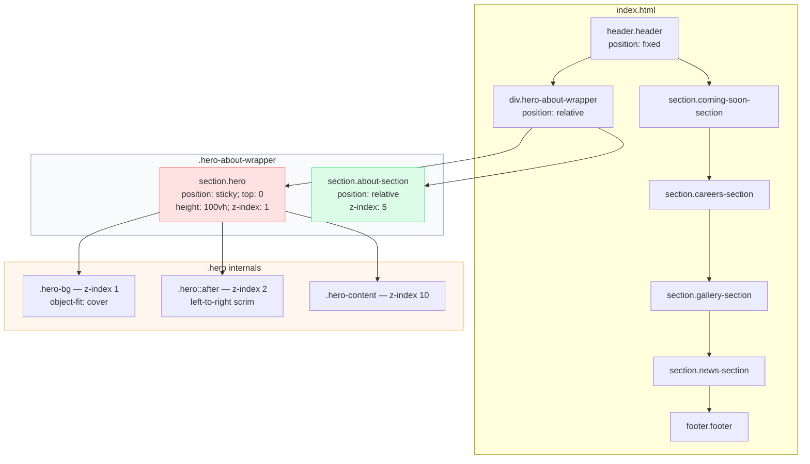

# Pixar Animation Studios — Landing Page

A responsive, dependency-free recreation of the Pixar Animation Studios homepage, built with semantic HTML and modern CSS. No framework, no build step, no JavaScript.

[](https://ayankunduixb-pixel.github.io/debugbattle1/)
[](https://developer.mozilla.org/en-US/docs/Web/HTML)
[](https://developer.mozilla.org/en-US/docs/Web/CSS)
[](#responsive-strategy)
[](#technology)
[](#deployment)

---

## Table of Contents

- [Preview](#preview)
- [Overview](#overview)
- [Technology](#technology)
- [Project Structure](#project-structure)
- [Architecture](#architecture)
  - [Page Composition](#page-composition)
  - [The Sticky Hero Technique](#the-sticky-hero-technique)
  - [Scroll-Driven Animations](#scroll-driven-animations)
  - [Section Reference](#section-reference)
- [Design System](#design-system)
- [Responsive Strategy](#responsive-strategy)
- [Accessibility](#accessibility)
- [Local Development](#local-development)
- [Deployment](#deployment)
- [Known Issues](#known-issues)
- [Credits](#credits)

---

## Preview

<!-- TODO: Replace the block below with a screenshot. See "Adding the screenshot" under Local Development. -->
<p align="center">
  <em>Screenshot placeholder — see instructions below</em>
</p>

---

## Overview

This project reproduces the visual language of the Pixar Animation Studios homepage: a fixed blurred navigation bar, a full-bleed hero, a pinned-scroll "about" reveal, a hover-expanding film carousel, an asymmetric masonry gallery, a news grid, and a link-dense footer.

The entire page is **2 files and zero dependencies**. There is no `package.json`, no bundler, and no `script` tag. Open `index.html` in a browser and it runs.

Everything is driven by three modern CSS capabilities:

1. **CSS Grid** for all layout — including an asymmetric 12-row gallery spanning three proportional columns.
2. **`position: sticky`** for pinned scroll storytelling.
3. **Scroll-driven animations** (`animation-timeline: view()`) for the footer's reveal-on-scroll, progressively enhanced behind `@supports`.

---

## Technology

| Layer | Choice | Rationale |
| --- | --- | --- |
| Markup | HTML5 | Semantic landmarks (`header`, `nav`, `section`, `article`, `footer`) |
| Styling | CSS3 (custom, no framework) | Grid, custom properties-free token discipline via grouped rules |
| Layout | CSS Grid + Flexbox | Gallery uses a 3-column × 12-row explicit placement grid |
| Motion | CSS transitions + `@keyframes` | Button fills, card hovers, carousel expansion |
| Scroll animation | `animation-timeline: view()` | Chrome/Edge 115+, feature-detected |
| Type | Montserrat (Google Fonts) + local WOFF2 | Fluid sizing via `clamp()` |
| Runtime JS | **None** | All behaviour is declarative CSS |
| Hosting | GitHub Pages | Serves from `main`, auto-deploys on push |

---

## Project Structure

```
debugbattle1/
├── index.html                 # Single page, 363 lines, all markup
├── styles.css                 # Single stylesheet, 1276 lines, commented by section
├── fonts/
│   └── ExplorerCondensed-Bold.woff2   # Display face (currently undeclared — see Known Issues)
├── README.md
└── 20260921-1345-34.7565300.mp4      # 100 MB screen recording, unreferenced
```

The dependency surface is intentionally zero. There is nothing to install, nothing to build, and no lockfile to rot.

---

## Architecture

### Page Composition

The document is a linear stack of full-width `<section>` elements. The only structural wrapper in the markup is `.hero-about-wrapper`, which exists solely to give the sticky hero somewhere to travel.



### The Sticky Hero Technique

The hero is the project's signature interaction and is worth explaining, because it is easy to break.

`.hero-about-wrapper` is `position: relative` and derives its own height from its two children: the `100vh` hero plus the `min-height: 100vh` about section — roughly `200vh` of runway.

`.hero` is then `position: sticky; top: 0`:

- **While the wrapper's first 100vh scrolls past**, the hero is pinned to the viewport top. The background image and scrim stay put while the page moves.
- **Once the wrapper's remaining height is consumed**, the sticky constraint releases and the hero is pushed out of view.
- `.about-section` carries `z-index: 5` against the hero's `z-index: 1`, so it composites *above* the pinned hero rather than beneath it.

Three stacked layers build the hero's depth, ordered strictly by `z-index`:

| Layer | Selector | z-index | Role |
| --- | --- | --- | --- |
| Background | `.hero-bg` | 1 | `` scaled to `cover`, supplies the red palette |
| Scrim | `.hero::after` | 2 | Left-to-right gradient, darkens text side |
| Content | `.hero-content` | 10 | Title, description, CTA |

> **Do not** set `.hero` to `position: absolute` or `relative`. Either removes the sticky constraint and collapses the whole effect into a single static screen.

### Scroll-Driven Animations

The footer reveals itself using the CSS scroll-driven animations specification. `styles.css` guards the entire block with `@supports` so browsers without support simply get a visible footer rather than a blank one:

```css
@supports (animation-timeline: view()) {
  .footer .container {
    animation: footer-content-reveal linear both;
    animation-timeline: view();
    animation-range: cover 13% cover 22%;
    opacity: 0;
    transform: translateY(36px);
  }
}
```

The animation is **scroll-linked, not time-linked**: `animation-timeline: view()` binds progress to the element's own position within the scrollport, and `animation-range` maps the reveal to the narrow band between 13% and 22% of the element's coverage. Progress is tied directly to scroll offset with no scroll listener and no `requestAnimationFrame` loop.

Because the base state (`opacity: 0`) only applies *inside* the `@supports` block, non-supporting browsers never see the hidden state at all. This is the correct way to progressively enhance.

### Section Reference

| Section | Root selector | Layout technique | Notable behaviour |
| --- | --- | --- | --- |
| Navigation | `.header` | Flexbox, `position: fixed` | `backdrop-filter: blur(5px)` over a dark gradient |
| Hero | `.hero` | Flexbox + sticky | Full-bleed `object-fit: cover` background, gradient scrim |
| About | `.about-section` | 2-col Grid, `minmax(0, 1fr)` | Scrolls over the pinned hero |
| Coming Soon | `.coming-soon-section` | Flexbox, scroll-snap rail | Cards expand `flex: 1` → `flex: 2` on hover |
| Careers | `.careers-section` | 2-col Grid header + text block | `position: sticky; top: 0`, `100vh` |
| Gallery | `#gallery-grid` | Explicit 3-col × 12-row Grid | `nth-child` placement, `object-fit: cover`, hover scale |
| News | `.news-section` | 4-col Grid | Cards lift `translateY(-5px)` on hover |
| Footer | `.footer` | 4-col Grid | Scroll-driven reveal, `@supports` gated |

All grid tracks use `minmax(0, 1fr)` rather than bare `1fr`. The `0` minimum is what prevents long unbroken content — image URLs, unbroken legal link text — from forcing tracks wider than their share.

---

## Design System

### Colour

Values are declared as raw hex in grouped rules rather than custom properties.

| Token (informal) | Value | Applied to |
| --- | --- | --- |
| Pixar red | `#c73b3b` | Outline buttons, carousel hover, newsletter arrow |
| Warm red | `#e8543a` | Hero gradient start, news card 1 |
| Deep red | `#8b2525` | Hero gradient end |
| Ink navy | `#1e2a4a` | Footer wordmark, footer rule, legal text |
| Near-black | `#1a1a1a` | Body copy, headings |
| Muted grey | `#666666` | Secondary copy, metadata |
| Surface grey | `#e0e0e0` / `#f5f5f5` | Borders, image placeholders |
| White | `#ffffff` | Page background, hero text |

### Typography

| Face | Source | Role |
| --- | --- | --- |
| **Montserrat** 400–800 | Google Fonts, `display=swap` | Body, UI, navigation |
| **Explorer** | `fonts/ExplorerCondensed-Bold.woff2` | Display headings |

Display sizes are fluid via `clamp()` so they scale with the viewport and never need per-breakpoint overrides:

```css
.section-title      { font-size: clamp(28px, 5vw, 60px); }
.hero-title         { font-size: clamp(32px, 4vw, 48px); }
.about-content h2   { font-size: clamp(28px, 3vw, 36px); }
#careers-title      { font-size: clamp(30px, 4vw, 48px); }
```

> The `Explorer` family is referenced but never declared via `@font-face`, so it currently resolves to a fallback. See [Known Issues](#known-issues).

### Buttons

Both variants animate a pseudo-element fill behind the label. The parent carries `isolation: isolate` to establish a stacking context — without it, the fill's `z-index: -1` escapes behind the button's own background and the effect never appears.

```css
.btn-primary::before  { /* 0 × 0 circle at centre */ }
.btn-primary:hover::before  { width: 250%; height: 600%; }   /* grows past the edges */

.btn-outline::before  { width: 0%; }
.btn-outline:hover::before { width: 100%; }               /* wipes left → right */
```

---

## Responsive Strategy

Layout degrades from a desktop composition down through four ranges. The two upper bounds are `min-width` desktop refinements; the lower bounds progressively collapse the grid.

| Query | Effective width | What changes |
| --- | --- | --- |
| `min-width: 1201px` | Desktop XL | Widest gaps, hero background shifted right, `20px` nav gap |
| `901px – 1200px` | Desktop / Tablet L | Tightened gaps, `14px` nav gap, `160px` careers label column |
| `max-width: 900px` | Tablet | Nav collapses to `.menu-toggle`; about → 1 col; carousel drops to 1 card; careers header stacks; gallery → 2 col; footer → 2 col |
| `max-width: 640px` | Mobile | Hero → `100svh`; carousel → `2:3` snap rail; gallery → horizontal scroll-snap rail; news → 1 col; footer → single centred column |
| `max-width: 400px` | Small Mobile | Tighter inline padding, smaller buttons, reduced header action gap |

Two details worth calling out:

- **`100svh`, not `100vh`** on mobile. On mobile browsers `100vh` includes the space behind the collapsing URL bar, so a `100vh` hero gets clipped. `svh` uses the *small* viewport height and stays fully visible.
- **The gallery changes layout mode entirely** at mobile, from `display: grid` to `display: flex` with `scroll-snap-type: x mandatory`, becoming a swipeable rail. The `nth-child` grid placements are reset to `auto` first so they don't fight the new layout.

---

## Accessibility

| Concern | Implementation |
| --- | --- |
| Icon-only buttons | `aria-label` on search, menu, and both carousel arrows |
| Image alternatives | Descriptive `alt` on all content images |
| Reduced motion | `prefers-reduced-motion: reduce` disables footer animation and forces the visible state |
| Feature detection | `@supports (animation-timeline: view())` — no hidden content without support |
| Semantic structure | `header` / `nav` / `section` / `article` / `footer` landmarks |
| Smooth scrolling | `scroll-behavior: smooth` with native anchor navigation |

**Gaps:** the menu toggle and carousel arrows have no `aria-expanded` / `aria-controls` state and no JavaScript to drive them; the newsletter form has no `action` or `name` attributes; `input:focus { outline: none }` removes the only focus indicator. These are listed in [Known Issues](#known-issues).

---

## Local Development

There is nothing to install. The page is static.

```bash
git clone https://github.com/ayankundux-pixel/debugbattle1.git
cd debugbattle1
```

Then either open `index.html` directly, or serve it to get correct `scroll-behavior` and remote image loading in every browser:

```bash
npx serve .
# or
python -m http.server 8000
```

### Adding the screenshot

The **Preview** section above expects an image at `docs/preview.png`. To generate it:

```bash
mkdir docs
```

Open the served page, capture a full-page screenshot (Chrome DevTools → `Ctrl+Shift+P` → *"Capture full size screenshot"*), and save it as `docs/preview.png`. The README slot will pick it up automatically once the file exists.

---

## Deployment

Deployment is automatic via **GitHub Pages**, configured to publish from the `main` branch root.

Push to `main` and the site rebuilds:

```bash
git add .
git commit -m "Describe the change"
git push origin main
```

Live at **https://ayankunduixb-pixel.github.io/debugbattle1/**

> **Note on repository size.** The repository tracks a ~100 MB `.mp4` screen recording, which is also in Git history. Cloning this repository downloads that file. It is **not** referenced anywhere in the markup. If the repository is ever made larger, GitHub rejects pushes above the 100 MB per-file limit with `error: large files detected`. Moving the video to Git LFS or removing it from tracking both require a history rewrite to fully reclaim the space.

---

## Known Issues

Honest list of outstanding defects, roughly in priority order.

**Dead CSS selectors** — rules that match nothing in the markup:

| Selector | Location | Markup actually uses |
| --- | --- | --- |
| `.carousel-container` | `styles.css:395` | `.carousel-list` |
| `.logo` | `styles.css:154` | `.brand-logo` |
| `.search-btn` | `styles.css:194` | `.search-icon` |
| `.careers-gallery-wrapper` | `styles.css:477` | not present in markup |

**Undeclared font.** `Explorer` is referenced at `styles.css:124`, `:315`, and `:371`, but there is no `@font-face` rule, so `fonts/ExplorerCondensed-Bold.woff2` is never loaded and all display headings fall back to Montserrat.

**Unused `@keyframes`.** `footer-line-reveal` (`styles.css:754`) is defined but never applied to any selector. `.footer::before` declares `transform-origin: left` with no initial `scaleX(0)`, so the footer's top rule renders statically rather than animating.

**Missing runtime.** There is no JavaScript. `.menu-toggle` is hidden below 900px and nothing toggles it, so the site has no navigation path on a phone. `.carousel-arrow` buttons and `.search-icon` are equally inert.

**Markup defects.** An unclosed `<li>` at `index.html:20`; a leftover `<!-- Malformed HTML comment -->` at `index.html:106`; an empty `alt=""` at `index.html:276`; two elements styled by ID selector (`#careers-title`, `#gallery-grid`) rather than class.

**Form and focus.** `.newsletter-form` has no `action`, its input has no `name`, and submitting navigates away. `input:focus { outline: none }` removes the keyboard focus indicator.

**Hotlinked assets.** Every image is loaded from a third-party URL rather than served locally. Any host that blocks hotlinking or goes down breaks the layout, and the page cannot render offline.

**Leftover spacing.** `.footer-legal` carries `margin-bottom: 80px` and `.footer-top` a `margin: 56px auto 28px` from earlier layout iteration.

---

## Credits

- **Upstream.** Forked from [`nycevents/debugbattle1`](https://github.com/nycevents/debugbattle1), the starting point for this exercise.
- **Trademark.** "Pixar", "Disney", the Luxo lamp and all film imagery are trademarks of their respective owners. This is a non-commercial educational recreation and is not affiliated with or endorsed by Pixar Animation Studios or The Walt Disney Company.
- **Typefaces.** Montserrat via [Google Fonts](https://fonts.google.com/specimen/Montserrat). Explorer Condensed ships in `fonts/`.
- **Deployment.** [GitHub Pages](https://pages.github.com/).

**Licence.** No `LICENSE` file exists in this repository, so no licence can be asserted. Because this is a fork, the terms come from the upstream project — check `nycevents/debugbattle1` before reusing this code.